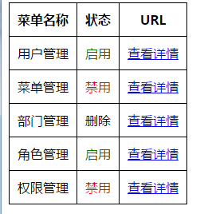

内置的过滤器已经学会了：

- lowercase
- uppercase
- date
- number
- currency
- limitTo
- filter
- orderBy

这时候，该学习自定义过滤器了。总共9中过滤器，学完截止。

代码如下：

index.html

	<!DOCTYPE html>
	<html ng-app="myApp">
	<head>
	    <title></title>
	    
	    
	    
	    
	</head>
	<body>
	    

	        <table>
	            <thead>
	                <tr>
	                    <th>菜单名称</th>
	                    <th>状态</th>
	                    <th>URL</th>
	                </tr>
	            </thead>
	            <tbody>
	                <tr ng-repeat="menu in menus">
	                    <td>{{menu.name }}</td>
	                    <td ng-bind-html="menu.status|status"></td>
	                    <td ng-bind-html="menu.url|url"></td>
	                </tr>
	            </tbody>
	        </table>
	    

	</body>
	</html>

index.js

	var app=angular.module("myApp", []).controller("myController", function ($scope) {
	    $scope.menus = [
	           {
	               name: "用户管理", status: 1, url: "http://www.baidu.com"
	           },
	           {
	               name: "菜单管理", status: 2, url: "http://www.baidu.com"
	           },
	           {
	               name: "部门管理", status: 0, url: "http://www.baidu.com"
	           },
	           {
	               name: "角色管理", status: 1, url: "http://www.baidu.com"
	           },
	           {
	               name: "权限管理", status: 2, url: "http://www.baidu.com"
	           }
	    ];
	});

filters.js

	app.filter("status", function ($sce) {
	    return function (status) {
	        switch (status) {
	            case 1:
	                return $sce.trustAsHtml("启用");
	            case 2:
	                return $sce.trustAsHtml("禁用");
	            case 0:
	                return $sce.trustAsHtml("删除");
	            default:
	                return $sce.trustAsHtml("未知状态");
	        }
	    }
	})
	.filter("url", function ($sce) {
	    return function (url)
	    {
	        return $sce.trustAsHtml("<a href='javascript:;'>查看详情</a>")
	    }
	});

效果图：

