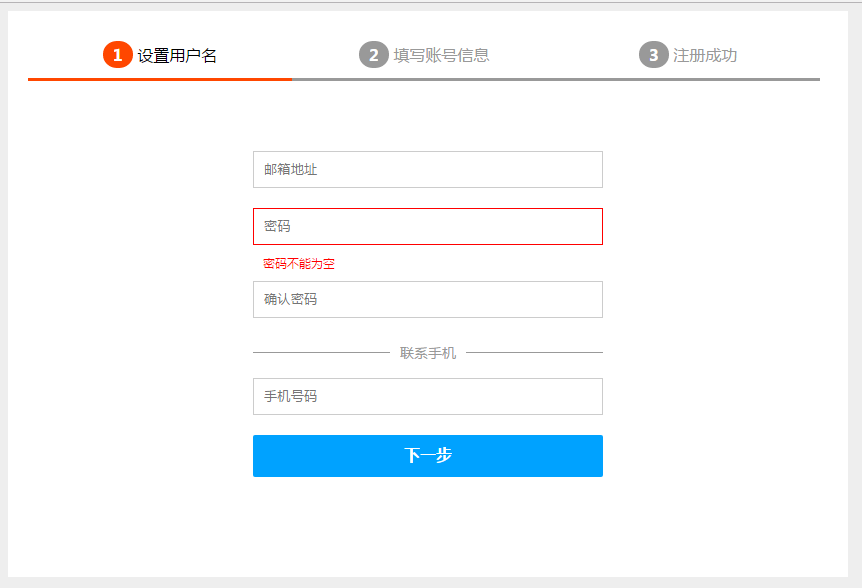

这节来学习

- ng-include

我们通过模拟分步注册，来学习ng-include

首先看下效果图：

ng-include可以用来制作这种包含部分页的功能。

> 代码比较粗糙，完全是为了试验，等学完angularjs会重新通过一个实战项目来巩固。

> **本次测试能够得出，第一步填写的内容在第二步提交中能够得到。具体看google的console.log输出。**

# 代码

index.css

	body{background-color:#eeeeee;color:#999;}
	        ul,ol,li,p{
	            margin:0px;
	            padding:0px;
	            list-style:none;
	        }
	        .main-item{
	            width:800px;
	            margin:0 auto;
	            padding:20px;
	            background-color:white;
	        }
	        .steps:after{
	            /*解决浮动后父元素高度不自动撑开的问题*/
	            content:"";
	            clear:both;
	            display:block;
	        }
	        .steps li{
	            float:left;
	            width:33%;
	            /*宽度包含padding*/
	            box-sizing:border-box;
	            padding:10px 30px;
	            border-bottom:solid 3px #999;
	            text-align:center;
	        }
	        .steps li strong{
	            background-color:#999;
	            display:inline-block;
	            padding:3px 10px;
	            border-radius:100%;
	            color:white;
	        }
	        .active{
	            color:black !important;
	             border-bottom:solid 3px #ff4700 !important; 
	        }
	        .active strong{
	            background-color:#ff4700 !important;
	             
	        }
	        .content-form{
	            width:350px;
	            margin:70px auto;
	        }
	       .content-form li input{
	            width:100%;
	            box-sizing:border-box;
	            padding:10px;
	            outline:none;
	            border:1px solid #ccc;
	        }
	       .content-form li input:focus{
	           border-color:#00a2ff;
	       }
	        .validate-error{
	           color:red !important;
	       }
	       .validate-error input{
	           border-color:red !important;
	       }
	        button{
	            width:100%;
	            box-sizing:border-box;
	            line-height:40px;
	            background-color:#00a2ff;
	            border:0px;
	            color:white;
	            font-size:16px;
	            border-radius:2px;
	            font-weight:bold;
	            cursor:pointer;
	            margin-bottom:10px;
	        }
	        button:hover{
	            background-color:#0395e8;
	        }
	        button.btn-pre,button.btn-pre:hover{
	            background-color:#bfc2c3;
	        }
	        .tip{
	            padding:10px 10px;
	            font-size:12px;
	        }
	        .sp-line{
	            text-align:center;
	            font-size:14px;
	            line-height:20px;
	        }
	       .sp-line .line{
	            display:inline-block;
	            width:100%;
	            border-top: solid 1px #999;
	        }
	       .sp-line .title{
	           position:relative;
	           top:-15px;
	           background-color:white;
	           padding:0px 10px;
	       }

index.js

	var app = angular.module("myApp", []).controller("myController", function ($scope) {
	    $scope.step = "register_step_1.html";
	    $scope.next = function (i) {
	        $scope.step = "register_step_" + i + ".html";
	        $scope.setStepsTitle(i);
	    }
	    $scope.pre = function (i) {
	        $scope.step = "register_step_" + i + ".html";
	        $scope.setStepsTitle(i);
	    }
	    $scope.user = {  };
	    $scope.submit = function (i) {
	        console.log($scope.user);
	        if ($scope.user.email == undefined) {
	            return false;
	        }
	        $scope.step = "register_step_" + i + ".html";
	        $scope.setStepsTitle(i);
	        
	    }
	    $scope.setStepsTitle = function (index) {
	        var lis = document.getElementById("steps").getElementsByTagName("li");
	        for (var i = 1; i <= lis.length; i++) {
	            lis[i-1].className =(i>index)?"":"active";
	        }
	    }
	});

index.html

	<!DOCTYPE html>
	<html ng-app="myApp">
	<head>
	    <title></title>
	    <link href="index.css" rel="stylesheet" />
	    
	    
	</head>
	<body ng-controller="myController">
	    

	        <ul class="steps" id="steps">
	            <li class="active">
	                <strong>1</strong>
	                设置用户名
	            </li>
	            <li>
	                <strong>2</strong>
	                填写账号信息
	            </li>
	            <li>
	                <strong>3</strong>
	                注册成功
	            </li>
	        </ul>
	        

	        

	    

	</body>
	</html>

register_step_1.html

	

	    <ul>
	        <li>
	            <input type="text" placeholder="邮箱地址" ng-model="user.email" />
	            

	        </li>
	        <li class="validate-error">
	            <input type="password" placeholder="密码" ng-model="user.password" />
	            
密码不能为空

	        </li>
	        <li>
	            <input type="password" placeholder="确认密码" />
	            

	        </li>
	    </ul>
	
	    

	        
	        联系手机
	    

	
	    <ul>
	        <li>
	            <input type="text" placeholder="手机号码" ng-model="user.phone" />
	            

	        </li>
	    </ul>
	
	    <button ng-click="next(2)">下一步</button>
	

register_step_2.html

	

	    <ul>
	        <li>
	            <input type="text" placeholder="用户昵称" ng-model="user.nickname" />
	            

	        </li>
	        <li>
	            <input type="text" placeholder="身份证号" />
	            

	        </li>
	        <li>
	            <input type="text" placeholder="收货地址" />
	            

	        </li>
	    </ul>
	    <button class="btn-pre" ng-click="pre(1)">上一步</button>
	    <button ng-click="submit(3)">同意并提交</button>
	

register_step_3.html

	

	    注册成功
	
