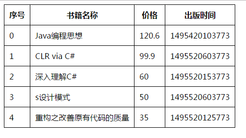
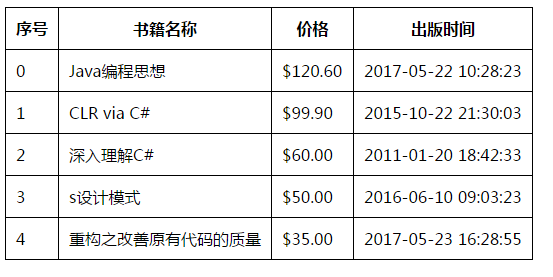

在上节中我们学到了，

- 什么是Angular，以及使用Angular的好处？
- 理解了Angular的两大特点，双向绑定和依赖注入。
- Angular的两大最重要的警句，1-和原生JS不互通，2-开发模式不一样，只需要关注数据就行

这节我们将讨论如下知识点:

1. Module、Controller和$scope
2. ng-repeat
3. filter
4. ng-hide和ng-show
5. ng-src和ng-href
6. ng-cloak

## Module、Controller和$scope

module是模块，是angular的入口。还记得上节的ng-app=“”吗？？这是使用了angular的默认module，我们也可以定义自己的module来使用，一个页面可以有多个module。

Controller是MVC中的C，上节提到的angular和原生JS不互通，如果想要互通就需要用到控制器，一个页面可以有多个module，一个module中也可以有多个控制器

$scope是一个angular内置的service，它通过依赖注入到Controller中。它是核心的范围对象。所有原生JS都是加在它的范围中的，而不会零散的分散。所有需要互通原生JS需要用到scope。

下面来看个例子：

	<!DOCTYPE html>
	<html ng-app="App">
	<head>
	    <title></title>
	    
	    
	</head>
	<body ng-controller="MainCtrl">
	    <input type="text" ng-model="str" />
	     
	    <button ng-click="alert()">Clike Me</button>
	</body>
	</html>

## ng-repeat指令

ng-repeat指令可以遍历数组和json。

	<!DOCTYPE html>
	<html ng-app="App">
	<head>
	    <title></title>
	    
	    
	    
	</head>
	<body ng-controller="MainCtrl">
	    <table>
	        <thead>
	            <tr>
	                <th>序号</th>
	                <th>书籍名称</th>
	                <th>价格</th>
	                <th>出版时间</th>
	            </tr>
	        </thead>
	        <tbody>
	            <tr ng-repeat="(index,book) in books ">
	                <td>{{index}}</td>
	                <td>{{book.name}}</td>
	                <td>{{book.price}}</td>
	                <td>{{book.publicationTime}}</td>
	            </tr>
	        </tbody>
	    </table>
	</body>
	</html>

效果图：

出版时间还是时间戳，价格也不保留两位小数点.这些都需要过滤器来解决

## filter过滤器

过滤器指的是数据在显示出来之间要先经过指的的过滤器过滤一遍，比如下面我们将要调整的出版时间，价格

因为angular作者是美国的，所以这里价格是美元符号，如果想换成中文符号需要定义自己的过滤器，不能使用默认的过滤器。

这里只是简单介绍两种过滤器已经使用方法，其实还有很多过滤器，在youtebu时候已经使用过了。

用法：

	<td>{{book.price|currency }}</td>
    <td>{{book.publicationTime|date:"yyyy-MM-dd HH:mm:ss"}}</td>

过滤之后的效果：

## ng-hide和ng-show

控制view中元素的显示和隐藏。ng-hide和ng-show用法一模一样，只是功能相反

	<!DOCTYPE html>
	<html ng-app="App">
	<head>
	    <title></title>
	    
	    
	</head>
	<body ng-controller="MainCtrl">
	    <button ng-click="ishide=!ishide">显示/隐藏</button>
	     
	    

	
	    

	</body>
</html>

## ng-src和ng-href

先看正常的img使用angular会遇到什么问题？

	<!DOCTYPE html>
	<html ng-app="App">
	<head>
	    <title></title>
	    
	    
	</head>
	<body ng-controller="MainCtrl">
	    
	</body>
	</html>

浏览页面，发现页面也没问题，但是打开开发者选项，发现有404错误

	GET http://localhost:3639/%7B%7Bimage%7D%7D 404 (Not Found)

这是因为什么原因造成的呢？？

> 浏览器是自上往下加载的，当加载到img标签解析时候，src的地址是{{image}}，所以回去远程服务器取这个地址，所以出现404？

怎么解决？？

 	

ng-src和ng-href等同于html中的src和href，只是ng是在dom加载完毕之后才能够发挥作用，如果在src或href中绑定变量，如果ng没有加载完，会导致链接地址出错，如果用对应的ng-src或ng-href，则不会出现这个问题

## ng-cloak

ng-cloak指令是angular的内置指令，它的作用是隐藏所有被它包含的元素：

	

	  <h1>Hello {{ name }}</h1>
	

在浏览器加载和编译渲染完成之后，angular会自动删除ngCloak元素属性，这样这个元素就会变成可见的。

要想cloak生效还需要在页面中加入

	