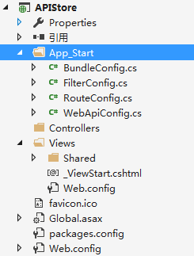

在学习后面的 $http  之前，需要先构建一套接口来进行配合，所以加一层番外篇，顺带感受一下MVC6中webapi的新特性

## 创建项目APIStore

通过VS2015创建一个webapi的项目，项目名称APIStore。

创建完成后把该删的都删除掉。因为这是一个纯API项目，所以大刀阔斧，该删的全删了。

1. **创建实体对象**

目录结构清理完成后，我们通过订单的操作为例子。订单得有订单实体、订单明细和订单状态等.所以我们新建一个Models用来存放这些实体对象。

Order.cs：

	using System;
	using System.Collections.Generic;
	using System.Linq;
	using System.Web;
	
	namespace APIStore.Models
	{
	    /// 

	    /// 订单实体对象
	    /// 

	    public class Order
	    {
	        /// 

	        /// 订单号
	        /// 

	        public string OrderNo { get; set; } 
	        /// 

	        /// 订单创建时间
	        /// 

	        public DateTime CreateTime { get; set; }
	        /// 

	        /// 订单总金额
	        /// 

	        public double Amount { get; set; }
	        /// 

	        /// 订单明细
	        /// 

	        public List<OrderDetail> Details { get; set; }
	        /// 

	        /// 订单状态
	        /// 

	        public OrderStatus Status { get; set; }
	    }
	}

OrderDetail.cs

	using System;
	using System.Collections.Generic;
	using System.Linq;
	using System.Web;
	
	namespace APIStore.Models
	{
	    /// 

	    /// 订单明细实体
	    /// 

	    public class OrderDetail
	    {
	        /// 

	        /// 所属订单号
	        /// 

	        public string OrderNo { get; set; }
	        /// 

	        /// 商品名称
	        /// 

	        public string GoodsName { get; set; }
	        /// 

	        /// 商品价格
	        /// 

	        public double Price { get; set; }
	        /// 

	        /// 购买数量
	        /// 

	        public int Number { get; set; }
	    }
	}

Enums.cs

	using System;
	using System.Collections.Generic;
	using System.Linq;
	using System.Web;
	
	namespace APIStore.Models
	{
	    /// 

	    /// 订单状态
	    /// 

	    public enum OrderStatus
	    {
	        /// 

	        /// 未支付
	        /// 

	        UnPaid,
	        /// 

	        /// 已取消
	        /// 

	        Cancel,
	        /// 

	        /// 已支付未发货
	        /// 

	        UnShipping,
	        /// 

	        /// 已发货未收货
	        /// 

	        UnReceipt,
	        /// 

	        /// 已收货
	        /// 

	        Receipt,
	        /// 

	        /// 退款中
	        /// 

	        RefundPeriod,
	        /// 

	        /// 退款完成
	        /// 

	        RefundComplete
	    }
	}

2.**创建BaseAPI**

为了后面做接口统一授权验证，我们需要一个BaseApi.

创建一个Empty-Web API 2 Controller，名称为BaseController用作所有API接口的基类.

BaseController.cs:

    using System;
	using System.Collections.Generic;
	using System.Linq;
	using System.Net;
	using System.Net.Http;
	using System.Web.Http;
	
	namespace APIStore.Controllers
	{
	    public class BaseController : ApiController
	    {
	    }
	}

3.**初始化数据**

这里就不用数据库了，还得建库建表挺麻烦的。只是个用例，直接用静态类来模拟算了。创建一个订单的API继承BaseController，并且在构造函数中模拟一些初始化数据。

OrderController.cs

	using APIStore.Models;
	using System;
	using System.Collections.Generic;
	using System.Linq;
	using System.Net;
	using System.Net.Http;
	using System.Web.Http;
	using Newtonsoft.Json;
	
	namespace APIStore.Controllers
	{
	    public class OrderController : BaseController
	    {
	        private static List<Order> orders;
	        static OrderController()
	        {
	            string[] goodsname = { "AngularJS实战", "CLR via C#", "深入理解C#", "Java编程思想", "JavaScript编程宝典" };
	            Random rd = new Random();
	            orders = new List<Order>();
	            for (int i = 0; i < 100; i++)
	            {
	                Order order = new Order();
	                order.CreateTime = DateTime.Now.AddDays(-(rd.Next(0, 100)));
	                order.Status = OrderStatus.UnPaid;
	                order.Details = new List<OrderDetail>();
	                //随意生成的订单号，实际情况中考虑到高并发，服务器数据库等集群操作，需要使用radis或 MongoDB的ObjectId 来生成保证全局唯一性
	                //http://www.cnblogs.com/haoxinyue/p/5208136.html
	                order.OrderNo =DateTime.Now.AddHours(i).ToString("mmssyyyyddHHMM");
	                for (int j = 0; j < rd.Next(1, 5); j++)
	                {
	                    int price = rd.Next(1, 100);
	                    int number = rd.Next(1, 10);
	                    order.Amount += (price * number);
	                    order.Details.Add(new OrderDetail()
	                    {
	                        Number = number,
	                        Price = price,
	                        GoodsName = goodsname[rd.Next(0, 5)],
	                        OrderNo = order.OrderNo
	                    });
	                }
	                orders.Add(order);
	            }
	        }
	        [HttpGet]
	        [HttpPost]
	        public List<Order> GetAllOrders()
	        {
	            return orders;
	        }
	    }
	}

我们访问  http://localhost:32041/api/order/getallorders  是报错的，需要修改web.config

	  <appSettings>
	    <add key="owin:AutomaticAppStartup" value="false" />
	  </appSettings>
    <modules runAllManagedModulesForAllRequests="true">
      <remove name="FormsAuthentication" />
    </modules>

然后把  WebApiConfig.cs 中，注释掉。

	config.SuppressDefaultHostAuthentication();
	config.Filters.Add(new HostAuthenticationFilter(OAuthDefaults.AuthenticationType));

4.**修改数据返回格式**

默认我们可以看到是返回xml格式，但是我们希望返回JSON。

webapiconfig.cs

	using System;
	using System.Collections.Generic;
	using System.Linq;
	using System.Net.Http;
	using System.Web.Http;
	using Microsoft.Owin.Security.OAuth;
	using Newtonsoft.Json.Serialization;
	using System.Net.Http.Formatting;
	
	namespace APIStore
	{
	    public static class WebApiConfig
	    {
	        public static void Register(HttpConfiguration config)
	        {
	            // Web API configuration and services
	            // Configure Web API to use only bearer token authentication.
	            // config.SuppressDefaultHostAuthentication();
	            // config.Filters.Add(new HostAuthenticationFilter(OAuthDefaults.AuthenticationType));
	
	
	            #region 默认返回json类型配置
	            // Web API configuration and services
	            GlobalConfiguration.Configuration.Formatters.XmlFormatter.SupportedMediaTypes.Clear();
	            //默认返回 json  
	            GlobalConfiguration.Configuration.Formatters.JsonFormatter.MediaTypeMappings.Add(
	                new QueryStringMapping("datatype", "json", "application/json"));
	            //返回格式选择 datatype 可以替换为任何参数   
	            GlobalConfiguration.Configuration.Formatters.XmlFormatter.MediaTypeMappings.Add(
	                new QueryStringMapping("datatype", "xml", "application/xml"));
	            #endregion
	
	            // Web API routes
	            config.MapHttpAttributeRoutes();
	
	            config.Routes.MapHttpRoute(
	                name: "DefaultApi",
	                routeTemplate: "api/{controller}/{id}",
	                defaults: new { id = RouteParameter.Optional }
	            );
	        }
	    }
	}

访问以下试试：http://localhost:32041/api/order/getallorders

5.**统一返回JsonMsg**

如果中途假设逻辑有错误，没有返回的数据，我们需要返回500和错误信息，这时候最好的方式是封装一个JsonMsg的实体来用作接口的返回对象,新建一个Common文件夹用了存放共用的杂项。

JsonMsg.json

	[
	  {
	    "status": 200,
	    "msg": "请求成功"
	  },
	  {
	    "status": 500,
	    "msg": "服务器内部错误"
	  }
	]

JsonMsg.cs:

	using System;
	using System.Collections.Generic;
	using System.Linq;
	using System.Web;
	using System.IO;
	using Newtonsoft.Json;
	namespace APIStore.Common
	{
	    /// 

	    /// 接口返回对象
	    /// 

	    public class JsonMsg
	    {
	        /// 

	        /// 状态码
	        /// 

	        public int status { get; set; }
	        /// 

	        /// 数据
	        /// 

	        public object data { get; set; }
	        /// 

	        /// 消息
	        /// 

	        public string msg { get; set; }
	    }
	    /// 

	    /// JsonMsg工厂
	    /// 

	    public class JsonMsgFactory
	    {
	        private static Dictionary<int, JsonMsg> msgs;
	
	        static JsonMsgFactory()
	        {
	            msgs = new Dictionary<int, JsonMsg>();
	            string path = GetMapPath("~/common/jsonmsg.json"), json = string.Empty;
	            using (StreamReader reader = new StreamReader(path))
	            {
	                json = reader.ReadToEnd();
	            }
	            List<JsonMsg> jsonmsgs = JsonConvert.DeserializeObject<List<JsonMsg>>(json);
	            foreach (var item in jsonmsgs)
	            {
	                msgs.Add(item.status, item);
	            }
	            
	        }
	        /// 

	        /// 获取文件物理路径
	        /// 

	        /// <param name="path"></param>
	        /// <returns></returns>
	        private static string GetMapPath(string path)
	        {
	            if (HttpContext.Current != null)
	            {
	                return HttpContext.Current.Server.MapPath(path);
	            }
	            else
	            {
	                return System.Web.Hosting.HostingEnvironment.MapPath(path);
	            }
	        }
	        public static JsonMsg GetJsonMsg(int status)
	        {
	            return msgs[status];
	        }
	    }
	}

6.**BaseController重载获取JsonMsg的方法**

BaseController.cs:

	using APIStore.Common;
	using System;
	using System.Collections.Generic;
	using System.Linq;
	using System.Net;
	using System.Net.Http;
	using System.Web.Http;
	
	namespace APIStore.Controllers
	{
	    public class BaseController : ApiController
	    {
	        #region 获取返回对象
	        protected JsonMsg GetJsonMsg(int status) => JsonMsgFactory.GetJsonMsg(status);
	        protected JsonMsg GetJsonMsg(object data)
	        {
	            JsonMsg msg = JsonMsgFactory.GetJsonMsg(200);
	            msg.data = data;
	            return msg;
	        }
	        protected JsonMsg GetJsonMsg(int status, object data)
	        {
	            JsonMsg msg = JsonMsgFactory.GetJsonMsg(status);
	            msg.data = data;
	            return msg;
	        } 
	        #endregion
	    }
	}

OrderController.cs

		[HttpGet]
        [HttpPost]
        public JsonMsg GetAllOrders()
        {
            return GetJsonMsg(orders);
        }

7.**创建订单数据工厂**

把订单的初始化工作放在OrderController中是API看的很不好读，所以这里提取一个数据工厂类，实际项目中不会这么做的。

OrderFactory.cs

	using APIStore.Models;
	using System;
	using System.Collections.Generic;
	using System.Linq;
	using System.Web;
	
	namespace APIStore.Common
	{
	    public class OrderFactory
	    {
	        private static List<Order> orders;
	        static OrderFactory()
	        {
	            string[] goodsname = { "AngularJS实战", "CLR via C#", "深入理解C#", "Java编程思想", "JavaScript编程宝典" };
	            Random rd = new Random();
	            orders = new List<Order>();
	            for (int i = 0; i < 100; i++)
	            {
	                Order order = new Order();
	                order.CreateTime = DateTime.Now.AddDays(-(rd.Next(0, 100)));
	                order.Status = OrderStatus.UnPaid;
	                order.Details = new List<OrderDetail>();
	                //随意生成的订单号，实际情况中考虑到高并发，服务器数据库等集群操作，需要使用radis或 MongoDB的ObjectId 来生成保证全局唯一性
	                //http://www.cnblogs.com/haoxinyue/p/5208136.html
	                order.OrderNo = DateTime.Now.AddHours(i).ToString("mmssyyyyddHHMM");
	                for (int j = 0; j < rd.Next(1, 5); j++)
	                {
	                    int price = rd.Next(1, 100);
	                    int number = rd.Next(1, 10);
	                    order.Amount += (price * number);
	                    order.Details.Add(new OrderDetail()
	                    {
	                        Number = number,
	                        Price = price,
	                        GoodsName = goodsname[rd.Next(0, 5)],
	                        OrderNo = order.OrderNo
	                    });
	                }
	                orders.Add(order);
	            }
	        }
	        public static List<Order> Orders=>orders;
	    }
	}

OrderController.cs

	using APIStore.Models;
	using System;
	using System.Collections.Generic;
	using System.Linq;
	using System.Net;
	using System.Net.Http;
	using System.Web.Http;
	using Newtonsoft.Json;
	using APIStore.Common;
	
	namespace APIStore.Controllers
	{
	    public class OrderController : BaseController
	    {
	        [HttpGet]
	        [HttpPost]
	        public JsonMsg GetAllOrders()
	        {
	            return GetJsonMsg(OrderFactory.Orders);
	        }
	    }
	}

舒服多了

## 领略新特性

下面我们增加几个API：查询所有订单、带条件查询订单、获取订单总量、更新订单状态、创建新订单

我们随意增加之后，发现访问出错：

	{
	"Message": "An error has occurred.",
	"ExceptionMessage": "Multiple actions were found that match the request: \r\nGetAllOrders on type APIStore.Controllers.OrderController\r\nQueryOrders on type APIStore.Controllers.OrderController",
	"ExceptionType": "System.InvalidOperationException",
	"StackTrace": "   在 System.Web.Http.Controllers.ApiControllerActionSelector.ActionSelectorCacheItem.SelectAction(HttpControllerContext controllerContext)\r\n   在 System.Web.Http.Controllers.ApiControllerActionSelector.SelectAction(HttpControllerContext controllerContext)\r\n   在 System.Web.Http.ApiController.ExecuteAsync(HttpControllerContext controllerContext, CancellationToken cancellationToken)\r\n   在 System.Web.Http.Dispatcher.HttpControllerDispatcher.<SendAsync>d__1.MoveNext()"
	}

> WebApi 1.0一个api控制器只能有一个get、post、put、delete等请求的，这不符合RESTFUL规范，
> 
> 因此，2.0有了最新的特性，可以在控制器中随意路由，这个是真爽

	using APIStore.Models;
	using System;
	using System.Collections.Generic;
	using System.Linq;
	using System.Net;
	using System.Net.Http;
	using System.Web.Http;
	using Newtonsoft.Json;
	using APIStore.Common;
	
	namespace APIStore.Controllers
	{
	    [RoutePrefix("api/order")]
	    public class OrderController : BaseController
	    {
	        [Route("GetAllOrders")]
	        [HttpGet]
	        [HttpPost]
	        public JsonMsg GetAllOrders()
	        {
	            //查询所有订单
	            return GetJsonMsg(OrderFactory.Orders);
	        }
	        [Route("QueryOrders")]
	        [HttpGet]
	        [HttpPost]
	        public JsonMsg QueryOrders(dynamic paras)
	        {
	            //带条件的订单查询
	            return GetJsonMsg(200);
	        }
	        [Route("GetAllOrdersCount")]
	        [HttpGet]
	        [HttpPost]
	        public JsonMsg GetAllOrdersCount()
	        {
	            //获取订单总量
	            return GetJsonMsg(200);
	        }
	        [Route("UpdateStatus")]
	        [HttpPost]
	        public JsonMsg UpdateStatus(dynamic paras)
	        {
	            //更新订单状态，实际项目中在每个步骤完成后会更新状态,所以这个API不应该单独出现。
	            return GetJsonMsg(200);
	        }
	        [Route("CreateOrder")]
	        [HttpPost]
	        public JsonMsg CreateOrder(Order order)
	        {
	            //创建订单
	            OrderFactory.Orders.Add(order);
	            return GetJsonMsg(200);
	        }
	    }
	}

接下来就去一个一个实现我们API的功能吧...

具体请参考源码文件，因为其中遇到一些问题：

1. 如何解决owin的错误
2. 因为使用了静态的order集合，所以出现一些BUG，需要使用对象的深拷贝来解决
3. 如何实现RESTFUL风格
4. 如何实现接口授权验证