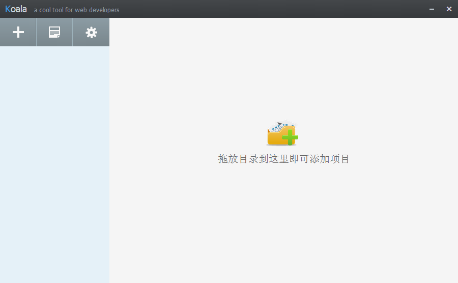
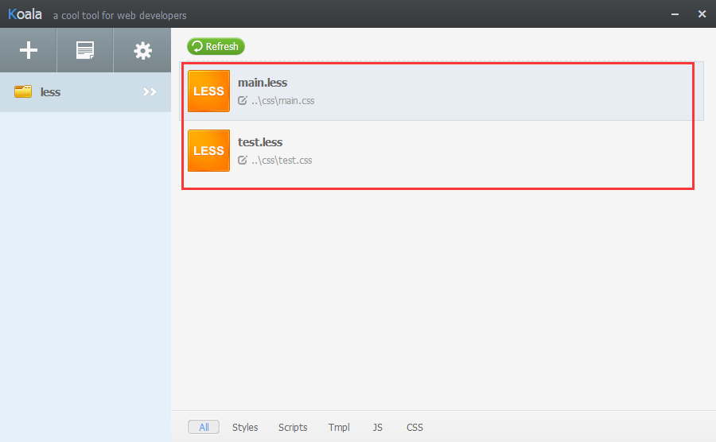

# Koala介绍
 koala 是一个编译less的小工具,当然编译less还可以采用node.js、Grunt等，本次我们采用Koala来对less进行编译。
 
 下载地址：[koala官网下载地址](http://koala-app.com/index-zh.html)
 
 下载安装完成后，打开界面如下图：
 
 
 可以点击设置按钮进行简体中文设置。
 
## koala编译
 
 编译就很简单了，只要把需要编译的less文件夹拖入到工具中即可执行编译，也可以鼠标右键进行编译和输出路径的设置
  

# 注释和变量

> 页面中使用还是得引用编译后的css，只是开发和维护用less 

注释：

 less中有两种注释，/**/和//，它们的区别在于第一种注释编译后会出现在真是的css项目中，第二种将不会执行编译

变量： 

 @test:300px;&nbsp;&nbsp;&nbsp;&nbsp;&nbsp;&nbsp;//这样就定义了一个变量名为test的变量

使用变量： 

 width:@test;  &nbsp;&nbsp;&nbsp;&nbsp;&nbsp;&nbsp; //设置宽度为300px

文件：main.less

    //定义测试宽度变量为200px
	@test_width:200px;
	body{
	  background-color: red;
	}
	/*设置宽度和高度为200px*/
	#box{
	  width:@test_width;
	  height: @test_width;
	  background-color: green;
	}

    
编译后：main.css
 
	body {
	  background-color: red;
	}
	/*设置宽度和高度为200px*/
	#box {
	  width: 200px;
	  height: 200px;
	  background-color: green;
	}

# 混合

文件:main.less

    /* 不带参数的混合*/
	.div{
	  .border;
	}
	.border{
	  border: solid 1px red;
	}
	/*带参数的混合*/
	.div_1{
	  .border_1(5px);
	}
	.border_1(@border_width){
	  border: solid @border_width red;
	}
	/*带默认值参数的混合,有默认值的参数放后面*/
	.div_2{
	  .border_2(green,20px);
	}
	.border_2(@border_color,@border_width:10px){
	  border: solid @border_width @border_color;
	}

编译后:main.css 

    /* 不带参数的混合*/
	.div {
	  border: solid 1px red;
	}
	.border {
	  border: solid 1px red;
	}
	/*带参数的混合*/
	.div_1 {
	  border: solid 5px #ff0000;
	}
	/*带默认值参数的混合,有默认值的参数放后面*/
	.div_2 {
	  border: solid 20px #008000;
	}

# 匹配模式

文件:main.less

    .matching(bottom,@w:5px,@c:red){
	  border-width: @w;
	  border-style: solid dashed dashed dashed;
	  border-color: @c transparent transparent transparent;
	}
	.matching(top,@w:5px,@c:red){
	  border-width: @w;
	  border-style:  dashed dashed solid dashed;
	  border-color:  transparent transparent @c transparent;
	}
	.matching(left,@w:5px,@c:red){
	  border-width: @w;
	  border-style:  dashed solid dashed dashed;
	  border-color:  transparent  @c transparent transparent;
	}
	.matching(right,@w:5px,@c:red){
	  border-width: @w;
	  border-style:  dashed dashed dashed solid;
	  border-color:  transparent transparent transparent @c;
	}
	.matching(@_,@w:5px,@c:red){
	  width: 0px;
	  height: 0px;
	  overflow: hidden;
	}
	#box{
	  .matching(left,5px, #c0161b);
	}

编译后：main.css

    #box {
	  border-width: 5px;
	  border-style: dashed solid dashed dashed;
	  border-color: transparent #c0161b transparent transparent;
	  width: 0px;
	  height: 0px;
	  overflow: hidden;
	}

# 运算

文化:main.less

    @h:130px;
	@cdn:"http://data.ddianle.com/ResourceDirectories/LWOL/upload/";
	#box{
	  border: solid 1px red;
	  height: (@h+10)*2;
	  width: (@h+10)*2;
	  background-image: url("@{cdn}20170301/feef6881-ec65-4b9e-b6cd-c7b875273b02.jpg");
	}

编译后：main.css

    #box {
	  border: solid 1px red;
	  height: 280px;
	  width: 280px;
	  background-image: url("http://data.ddianle.com/ResourceDirectories/LWOL/upload/20170301/feef6881-ec65-4b9e-b6cd-c7b875273b02.jpg");
	}

# 嵌套

文件:main.less

    .list{
	  width: 600px;
	  margin: 0 auto;
	  li{
	    line-height: 20px;
	    list-style: none;
	  }
	  a{
	    text-decoration: none;
	    &:hover{
	      color: red;
	    }
	  }
	  /*编译后生成 .list_t*/
	  &_t{
	    color: yellow;
	  }
	}

编译后：main.css

    .list {
	  width: 600px;
	  margin: 0 auto;
	  /*编译后生成 .list_t*/
	}
	.list li {
	  line-height: 20px;
	  list-style: none;
	}
	.list a {
	  text-decoration: none;
	}
	.list a:hover {
	  color: red;
	}
	.list_t {
	  color: yellow;
	}

# @arguments

文件:main.less

    .border_arg(@b-style:solid,@b-w:5px,@b-c:red){
	  border: @arguments;
	}
	#box{
	  width: 300px;
	  height: 300px;
	  .border_arg(dotted);
	}

编译后：main.css

    #box {
	  width: 300px;
	  height: 300px;
	  border: dotted 5px #ff0000;
	}

# !important

文件:main.less

    .lesstest(){
	  width: ~"calc(200px+22)";
	  height: 50px;
	}
	#box{
	  .lesstest() !important;
	}

编译后:main.css

    #box {
	  width: calc(200px+22) !important;
	  height: 50px !important;
	}
